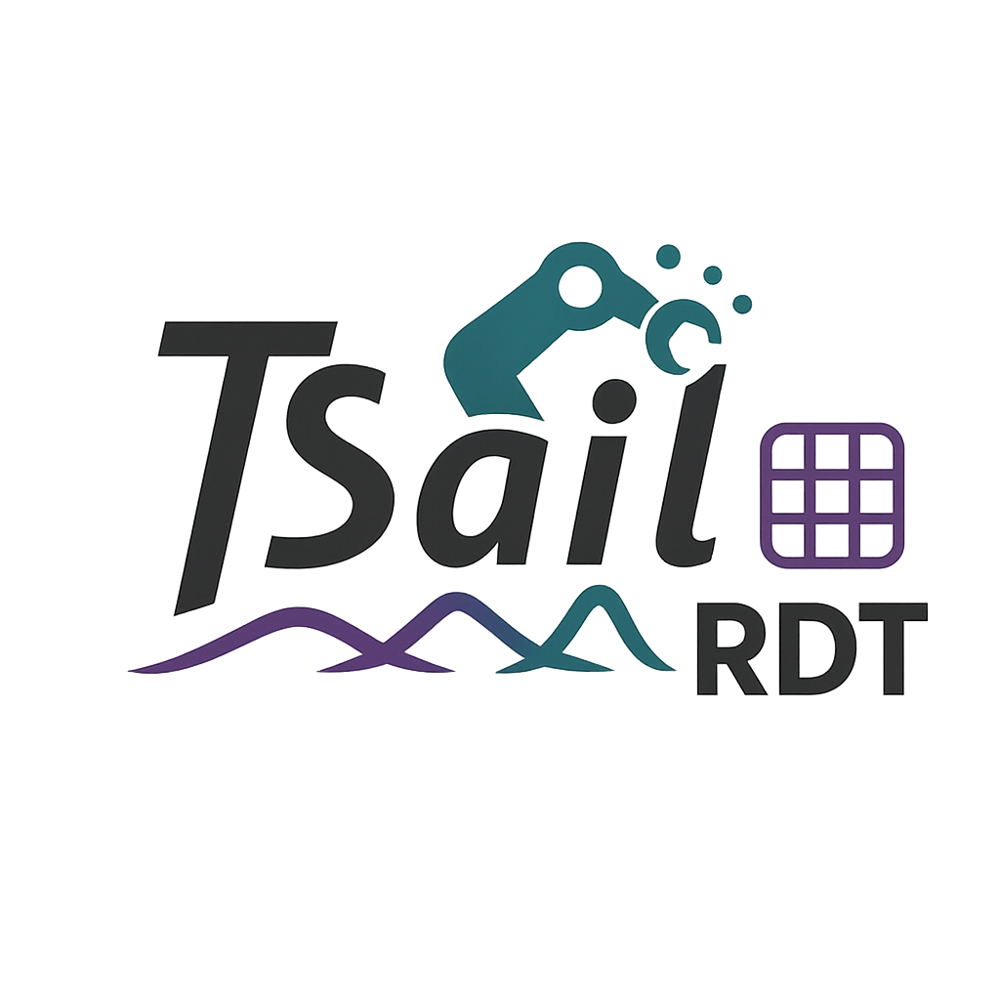

<!-- markdownlint-disable first-line-h1 -->
<!-- markdownlint-disable html -->
<!-- markdownlint-disable no-duplicate-header -->

<div align="center">
  <h1 style="font-size: 4rem; font-weight: bold; background: linear-gradient(45deg, #667eea, #764ba2); -webkit-background-clip: text; -webkit-text-fill-color: transparent; background-clip: text; text-shadow: 2px 2px 4px rgba(0,0,0,0.3); margin: 20px 0; display: flex; align-items: center; justify-content: center; gap: 20px;">
    
    RDT 2
  </h1>
</div>
<!-- <hr> -->
<div align="center" style="line-height: 1;">
  <a href="https://rdt-robotics.github.io/rdt-robotics/"></a>
  <a href="https://huggingface.co/thu-ml"></a>
  <br>
  <a href="https://discord.gg/vsZS3zmf9A"></a>
  <a href="https://rdt-robotics.github.io/rdt-robotics/wechat.html"></a>
  <!-- <a href="https://twitter.com/deepseek_ai"></a> -->
  <br>
  <a href="https://github.com/deepseek-ai/DeepSeek-V3/blob/main/LICENSE-CODE"></a>
  <a href="https://github.com/deepseek-ai/DeepSeek-V3/blob/main/LICENSE-MODEL"></a>
  <br>
  <a href="https://arxiv.org/pdf/2412.19437"><b>Blog Link</b>👁️</a> 
  <!-- <a href="https://arxiv.org/pdf/2412.19437"><b>Paper Link</b>📄</a> -->
</div>

## Table of Contents
- [Overview](#overview)
- [Updates](#updates)
- [Requirements](#requirements)
- [Installation](#installation)
- [Model Checkpoints](#model-checkpoints)
- [Running Inference for a Pre-Trained Model](#running-inference-for-a-pre-trained-model)
- [Fine-Tuning Models on Your Own Data](#fine-tuning-models-on-your-own-data)

## Overview

RDT2, the sequel to [RDT-1B](https://rdt-robotics.github.io/rdt-robotics/), is the first foundation model that can achieve **zero-shot deployment** on **unseen embodiments** for **simple open-vocabulary** tasks like picking, placing, shaking, wiping, etc. This milestone was made possible by multifaceted efforts:

- We redesigned the [UMI hardware]() by applying higher-strength materials and more precise tracking methods, ensuring its reliability for large-scale data collection.
- We collected **10,000+ hours** of human manipulation videos in **100+ different indoor scenes**, covering the majority of household tasks that a gripper can do.

Currently, this repo contains models:
- the [RDT2-VQ](link), an auto vision-language-action model (VLA) which employs [Residual VQ](https://arxiv.org/abs/2107.03312) as the action tokenizer, is adapted from [Qwen2.5-VL-7B-Instruct](https://huggingface.co/Qwen/Qwen2.5-VL-7B-Instruct) with our UMI dataset, enabling superior zero-shot instruction-following capability.

For all models, we provide checkpoints and examples for using them out of the box or fine-tuning them to your own datasets. Currently, we have verified the efficay of our models on platforms including [Bimanual UR5e]() and [Bimanual Franka Research 3](), and we are optimistic will able to deploy them successfully on more platforms in the future by following our [guidelines]().


## Updates

- [Sept 2025] We released RDT2-VQ, the sequel of RDT-1B with better open-world generalization and zero-shot deployment on unseen embodiments.

## Requirements

To run the models in this repository, you will need an NVIDIA GPU with at least the following specifications. These estimations assume a single GPU, but you can also use multiple GPUs with model parallelism or offload into CPU to reduce per-GPU memory. Since RDT2 is based on Qwen2.5-VL-7B, you basiclly need to follow the hard-ware requirements for Qwen2.5-VL-7B:

| Mode               | RAM Required | VRAM Required | Example GPU        |
| ------------------ | --------------- | --------------- | ------------------ |
| Inference          | > 32 GB      | 16 GB | RTX 4090           |
| Fine-Tuning (LoRA) |   -     | > 32 GB | A100 (40GB)           |
| Fine-Tuning (Full) |   -    |  > 80 GB  | A100 (80GB) / H100 / B200|

As for zero-shot deployment, you need to purchase the designated _end effector_ and _camera_, and 3D print the corresponding _camera stand_ and _flange_ according to [Harware installation and Calibration]().

The repo has been tested with Ubuntu 24.04, we do not currently support other operating systems.

## Installation

Clone this repo and create a conda environment:

```bash
# clone the repo
git clone https://github.com/thu-ml/RDT2.git
cd RDT2

# create a conda environment
conda create -n rdt2 python=3.10 -y
conda activate rdt2

# install torch (cuda12.8)
pip install torch==2.7.1 torchvision==0.22.1 --index-url https://download.pytorch.org/whl/cu128

# install flash 
pip install flash-attn --no-build-isolation

# install other dependencies
pip install -r requirements.txt

# Double check that you have the right transformers 4.51.3 installed
pip list | grep transformers

# to deploy on UR5e
pip install -r requirements/ur5e.txt

# to deploy on Franka Research 3
pip install -r requirements/franka_research_3.txt
```

## Model Checkpoints

<!-- ###  Models -->
We provide multiple VLA model checkpoints with capabilities to deploy on various robot platforms and simple vocabulary tasks. If you want to deploy on your own robot platform with other end effectors and cameras, you can fine-tune from the base model.


| Model        | Use Case    | Description                                                                                                 | Checkpoint Path                                |
| ------------ | ----------- | ----------------------------------------------------------------------------------------------------------- | ---------------------------------------------- |
| RDT2-VQ      | Inference & Fine-Tuning | Auto-regressive VLA with Residual VQ as the action tokenizer   | `🚧 In progress 🚧`    |

<!-- | $\pi_0$-FAST | Fine-Tuning | Base autoregressive [π₀-FAST model](https://www.physicalintelligence.company/research/fast) for fine-tuning | `gs://openpi-assets/checkpoints/pi0_fast_base` |
| $\pi_{0.5}$    | Fine-Tuning | Base [π₀.₅ model](https://www.physicalintelligence.company/blog/pi05) for fine-tuning    | `gs://openpi-assets/checkpoints/pi05_base`      | -->

<!-- ### Fine-Tuned Models -->


<!-- | Model                    | Use Case    | Description                                                                                                                                                                                              | Checkpoint Path                                       |
| ------------------------ | ----------- | -------------------------------------------------------------------------------------------------------------------------------------------------------------------------------------------------------- | ----------------------------------------------------- |
| $\pi_0$-FAST-DROID       | Inference   | $\pi_0$-FAST model fine-tuned on the [DROID dataset](https://droid-dataset.github.io/): can perform a wide range of simple table-top manipulation tasks 0-shot in new scenes on the DROID robot platform | `gs://openpi-assets/checkpoints/pi0_fast_droid`       |
| $\pi_0$-DROID            | Fine-Tuning | $\pi_0$ model fine-tuned on the [DROID dataset](https://droid-dataset.github.io/): faster inference than $\pi_0$-FAST-DROID, but may not follow language commands as well                                | `gs://openpi-assets/checkpoints/pi0_droid`            |
| $\pi_0$-ALOHA-towel      | Inference   | $\pi_0$ model fine-tuned on internal [ALOHA](https://tonyzhaozh.github.io/aloha/) data: can fold diverse towels 0-shot on ALOHA robot platforms                                                          | `gs://openpi-assets/checkpoints/pi0_aloha_towel`      |
| $\pi_0$-ALOHA-tupperware | Inference   | $\pi_0$ model fine-tuned on internal [ALOHA](https://tonyzhaozh.github.io/aloha/) data: can unpack food from a tupperware container                                                                                                             | `gs://openpi-assets/checkpoints/pi0_aloha_tupperware` |
| $\pi_0$-ALOHA-pen-uncap  | Inference   | $\pi_0$ model fine-tuned on public [ALOHA](https://dit-policy.github.io/) data: can uncap a pen                                                                                                          | `gs://openpi-assets/checkpoints/pi0_aloha_pen_uncap`  |
| $\pi_{0.5}$-LIBERO      | Inference   | $\pi_{0.5}$ model fine-tuned for the [LIBERO](https://libero-project.github.io/datasets) benchmark: gets state-of-the-art performance (see [LIBERO README](examples/libero/README.md)) | `gs://openpi-assets/checkpoints/pi05_libero`      |
| $\pi_{0.5}$-DROID      | Inference / Fine-Tuning | $\pi_{0.5}$ model fine-tuned on the [DROID dataset](https://droid-dataset.github.io/) with [knowledge insulation](https://www.physicalintelligence.company/research/knowledge_insulation): fast inference and good language-following | `gs://openpi-assets/checkpoints/pi05_droid`      | -->

## Running Inference for a Pre-Trained Model

### 1. [IMPORTANT] Hard-ware Set up and Calibration

🚧 In progress 🚧

### 2. Run Inference

Our pre-trained model checkpoints can be run with a few lines of code (here our [RDT2-VQ model]()):
```python
import torch
from transformers import AutoProcessor, Qwen2_5_VLForConditionalGeneration

from vqvae import MultiVQVAE
from models.normalizer import LinearNormalizer
from utils import batch_predict_action

# assuming using gpu 0
device = "cuda:0"


processor = AutoProcessor.from_pretrained("Qwen/Qwen2.5-VL-7B-Instruct")
model = Qwen2_5_VLForConditionalGeneration.from_pretrained(
    "link"
    torch_dtype=torch.bfloat16,
    attn_implementation="flash_attention_2",
    device_map=device
).eval()
vae = MultiVQVAE.from_pretrained("link").eval()
vae = vae.to(device=device, dtype=torch.float32)

valid_action_id_length = (
    vae.pos_id_len + vae.rot_id_len + vae.grip_id_len
)
normalizer = LinearNormalizer.from_pretrained("link")

result = batch_predict_action(
    model,
    processor,
    vae,
    normalizer,
    examples=[
        {
            "obs": {
                # NOTE: following the setting of UMI, camera0_rgb for right arm, camera1_rgb for left arm
                "camera0_rgb": ..., # RGB image in np.ndarray of shape (1, 384, 384, 3) with dtype=np.uint8
                "camera1_rgb": ..., # RGB image in np.ndarray of shape (1, 384, 384, 3) with dtype=np.uint8
            },
            "meta": {
                "num_camera": 2
            }
        },
        ...,    # we support batch inference, so you can pass a list of examples
    ]，
    valid_action_id_length=valid_action_id_length,
    apply_jpeg_compression=True,
    # Since model is trained with mostly jpeg images, we suggest toggle this on for better formance
    instruction="Pick up the apple."
    # We suggest using Instruction in format "verb + object" with Capitalized First Letter and trailing period 
)

# get the predict action from example 0
action_chunk = result["action_pred"][0] # torch.FloatTensor of shape (24, 20) with dtype=torch.float32
# action_chunk (T, D) with T=24, D=20
#   T=24: our action_chunk predicts the future 0.8s in fps=30, i.e. 24 frames
#   D=20: following the setting of UMI, we predict the action for both arms from right to left
#   - [0-2]: RIGHT ARM end effector position in x, y, z (unit: m)
#   - [3-8]: RIGHT ARMe nd effector rotation in 6D rotation representation
#   - [9]: RIGHT ARM gripper width (unit: m)
#   - [10-12]: LEFT ARM end effector position in x, y, z (unit: m)
#   - [13-18]: LEFT ARM end effector rotation in 6D rotation representation
#   - [19]: LEFT ARM gripper width (unit: m)

# rescale gripper width from [0, 0.088] to [0, 0.1]
for robot_idx in range(2):
    action_chunk[:, robot_idx * 10 + 9] = action_chunk[:, robot_idx * 10 + 9] / 0.088 * 0.1
```
You can also test this out in the [example notebook](examples/inference.ipynb).

We provide detailed step-by-step examples for running inference of our pre-trained checkpoints on [Bimanual UR5e](examples/ur5e/README.md) and [Bimanual Franka Research 3](examples/fr3/README.md) robots.

<!-- **Remote Inference**: We provide [examples and code](docs/remote_inference.md) for running inference of our models **remotely**: the model can run on a different server and stream actions to the robot via a websocket connection. This makes it easy to use more powerful GPUs off-robot and keep robot and policy environments separate. -->

**Test inference without a robot**: We provide a [script](examples/simple_client/README.md) for testing inference without a robot. This script will generate a random observation and run inference with the model. See [here](examples/simple_client/README.md) for more details.


## Fine-Tuning Models on Your Own Data

We provide fine-tune the $\pi_{0.5}$ model on the data from BimanualUR5e as a running example for how to fine-tune a base model on your own data. We will explain three steps:
1. Convert your data to a [webdataset]() shards (which we use for training for high-efficent IO)
2. Defining training configs and running training

### 1. Convert your data to a LeRobot dataset

We provide a minimal example script for converting assumed data sturcture to a webdataset dataset in [`examples/libero/convert_libero_data_to_lerobot.py`](examples/libero/convert_libero_data_to_lerobot.py). You can easily modify it to convert your own data! 

### 2. Defining training configs and running training

#### RDT2-VQ

Currently, we support the following fine-tuning methods:

- DeepSpeed training
- LoRA (low-rank adaptation) training

Since RDT2-VQ is based on Qwen2.5-VL, you are free to apply using other techniques including (e.g., fsdp, quantization) by following Qwen2.5-VL's fine-tunig practices.
We provide example fine-tuning scripts for [full-parameter](shell_scripts/train_rdt2_vq.py) and [LoRA](shell_scripts/train_rdt2_vq_lora.py) fine-tuning.

Although our RVQ demonstrates high generalization among both hand-held gripper data and real robot data. If you want to fine-tune on your own data with our Residual VQ as action tokenzer, 
we sincerely suggest you to ensure to firstly check the statistics of your data are within the bound of our Residual VQ. And then test the reconstruction error of your data.

**Note:** We provide a [script]() for compute normalization statistics fo action normalization for bound violation check. This can be beneficial if you are fine-tuning to a new task on a robot. 

Now we can kick off training with the following command:


```bash
# Single GPU training:
uv run scripts/train_pytorch.py <config_name> --exp_name <run_name> --save_interval <interval>

# Example:
uv run scripts/train_pytorch.py debug --exp_name pytorch_test
uv run scripts/train_pytorch.py debug --exp_name pytorch_test --resume  # Resume from latest checkpoint

# Multi-GPU training (single node):
uv run torchrun --standalone --nnodes=1 --nproc_per_node=<num_gpus> scripts/train_pytorch.py <config_name> --exp_name <run_name>

# Example:
uv run torchrun --standalone --nnodes=1 --nproc_per_node=2 scripts/train_pytorch.py pi0_aloha_sim --exp_name pytorch_ddp_test
uv run torchrun --standalone --nnodes=1 --nproc_per_node=2 scripts/train_pytorch.py pi0_aloha_sim --exp_name pytorch_ddp_test --resume

# Multi-Node Training:
uv run torchrun \
    --nnodes=<num_nodes> \
    --nproc_per_node=<gpus_per_node> \
    --node_rank=<rank_of_node> \
    --master_addr=<master_ip> \
    --master_port=<port> \
    scripts/train_pytorch.py <config_name> --exp_name=<run_name> --save_interval <interval>
```


<!-- ### 3. Spinning up a policy server and running inference

Once training is complete, we can run inference by spinning up a policy server and then querying it from a LIBERO evaluation script. Launching a model server is easy (we use the checkpoint for iteration 20,000 for this example, modify as needed):

```bash
uv run scripts/serve_policy.py policy:checkpoint --policy.config=pi05_libero --policy.dir=checkpoints/pi05_libero/my_experiment/20000
```

This will spin up a server that listens on port 8000 and waits for observations to be sent to it. We can then run an evaluation script (or robot runtime) that queries the server.

For running the LIBERO eval in particular, we provide (and recommend using) a Dockerized workflow that handles both the policy server and the evaluation script together. See the [LIBERO README](examples/libero/README.md) for more details. -->

<!-- If you want to embed a policy server call in your own robot runtime, we have a minimal example of how to do so in the [remote inference docs](docs/remote_inference.md). -->


### Precision Settings

Different models have their specific precision settings:

**Action Tokenizer (Residual VQ):**

Since the size of Residual VQ is very small, we use `float32` for both training and inference.

**RDT VLM ([RDT2-VQ]()):**

Uses full `bfloat16` (default) following Qwen2.5-VL. You can follow the practice for [Qwen2.5-VL](https://github.com/QwenLM/Qwen2.5-VL) to adjust the precision by applying techniques like mixed precision or quantization.

**RDT Action Expert ([RDT2-FM]() \& [RDT-FM-UltraFast]()):**

Uses full `bfloat16` for both training and inference. 

## Troubleshooting

We will collect common issues and their solutions here. If you encounter an issue, please check here first. If you can't find a solution, please file an issue on the repo (see [here](CONTRIBUTING.md) for guidelines).

| Issue                                     | Resolution                                                                                                                                                                                   |
| ----------------------------------------- | -------------------------------------------------------------------------------------------------------------------------------------------------------------------------------------------- 
| 🚧 In progress 🚧 | 🚧 In progress 🚧 |